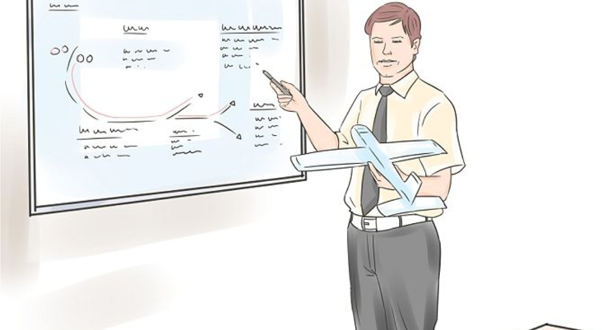
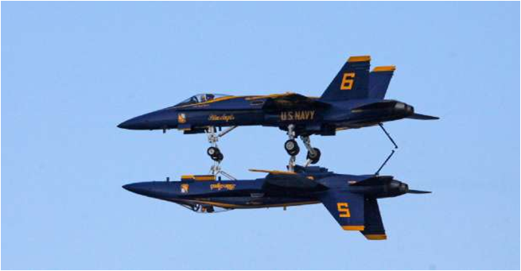
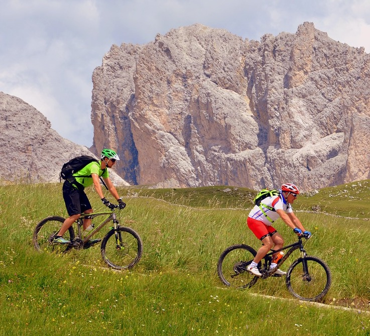

# AI Security for WAF Specialists

© Elephant Scale

---

## סדר יום

| מודול | נושא |
|--------|-------|
| 1 | מערכות AI עבור מהנדסי WAF |
| 2 | OWASP GenAI Top 10 |
| 3 | זיהוי Prompt Injection |
| 4 | חוקי WAF מודעי-AI |
| 5 | אבטחת צינורות RAG |
| 6 | אבטחת Agentic AI |
| 7 | אבטחת API עבור AI |
| 8 | הנדסת זיהוי ושילוב SOC |
| 9 | Cloud WAFs ואבטחת AI |
| 10 | בניית הגנת AI רב-שכבתית |

Notes:

---
## דרישות קדם וציפיות

 * ידע בסיסי בתכנות מונח כהנחת יסוד

 * נדרשת סביבת פיתוח לכתיבת קוד

     - נגדיר אותה יחד בכיתה
     
     - או בענן

 * סקרנות!

   - שאלו הרבה שאלות

 * זהו קורס AI Security ל-WAF
   - לא נדרש ידע מוקדם (אך עשוי לעזור)
   - הקורס יתנהל בקצב של רוב התלמידים
   
Notes

---
## פילוסופיית ההוראה שלנו

 * דגש על מושגים ויסודות

 * API - אין צורך לשנן דבר בעל-פה

 * אינטראקטיבי מאוד (שאלות ודיונים מבורכים)

 * התנסות מעשית (לומדים תוך כדי עשייה)

Notes

---

## הרבה מעבדות: לומדים תוך כדי עשייה

 <!-- {"left" : 1.37, "top" : 2.26, "height" : 5.65, "width" : 7.51} -->

Notes

---

## אנלוגיה: ללמוד לטוס...

 <!-- {"left" : 0.66, "top" : 2.06, "height" : 4.89, "width" : 8.93} -->

---

## היכרות

 <!-- {"left" : 0.6, "top" : 2.06, "height" : 4.96, "width" : 9.04} -->

Notes

---

## + שעות טיסה

 <!-- {"left" : 0.61, "top" : 2.06, "height" : 4.95, "width" : 9.04} -->

---

## זה ידרוש הרבה תרגול 

 <!-- {"left" : 0.69, "top" : 2.06, "height" : 5.63, "width" : 8.87} -->

---
## עליכם ועליי

* על המדריך
 * עליכם
     - שמכם
     - הרקע שלכם (מפתח, מנהל מערכת, מנהל, ...)
     - טכנולוגיות שאתם מכירים
     - מידת ההיכרות עם AI Security (בסולם 1 - 4 ;  1 - מתחיל,   4 - מומחה)
     - משהו לא-טכני עליכם! (טעם הגלידה האהוב / תחביב...)

 &nbsp; <!-- {"left" : 1.08, "top" : 6.08, "height" : 1.99, "width" : 2.25} --> &nbsp; <!-- {"left" : 3.36, "top" : 6.1, "height" : 1.92, "width" : 3.54} --> &nbsp; <!-- {"left" : 6.92, "top" : 6.08, "height" : 1.99, "width" : 2.25} -->
