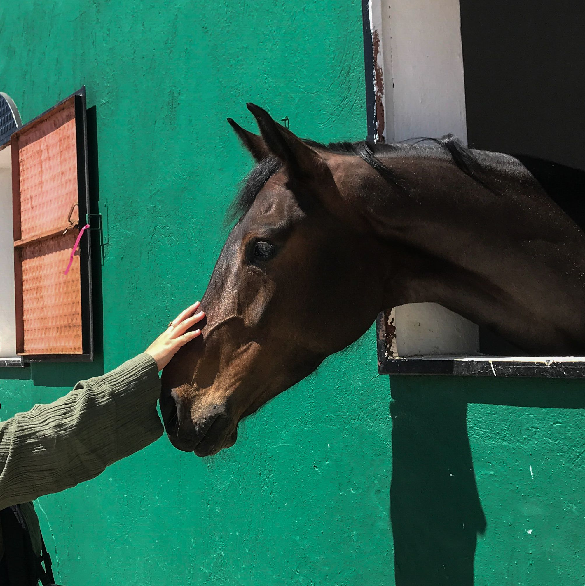
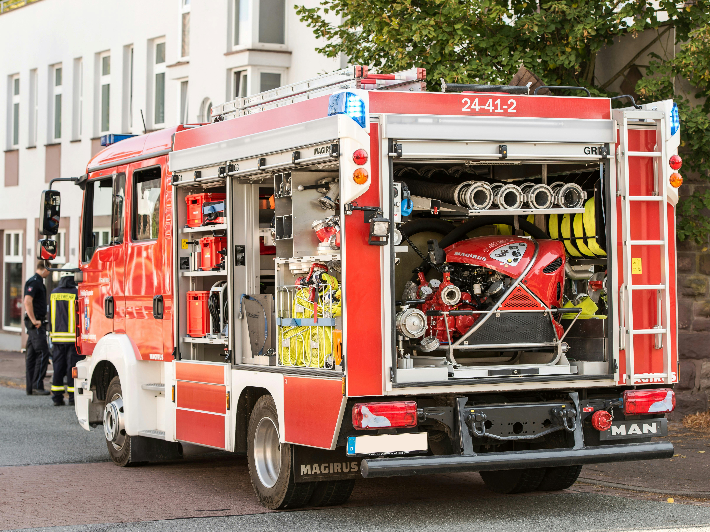

# Module 10 — Building a Layered AI Defense

© Elephant Scale

---

## Module 10 Agenda

- Why a WAF alone cannot secure AI
- The 10-layer AI defense model
- Layer 1: WAF
- Layer 2: API gateway
- Layer 3: AI gateway
- Layer 4: Guardrails
- Layer 5: Runtime monitoring
- Layer 6: Identity and authorization
- Layer 7: Sandbox
- Layer 8: Human approval
- Layer 9: Observability
- Layer 10: Incident response
- From WAF Engineer to AI Runtime Security Engineer
- Capstone preview

---

## The Core Thesis

**A WAF alone cannot secure AI.**

Here is why:

| Threat | WAF Coverage |
|---|---|
| DDoS on AI endpoint | ✓ Blocked |
| Unauthenticated access | ✓ Blocked |
| SQL injection in prompt | ✓ Blocked |
| Prompt injection (semantic) | ✗ Passes through |
| Jailbreak via paraphrase | ✗ Passes through |
| Retrieval poisoning (RAG) | ✗ Invisible |
| Tool abuse via agent | ✗ Invisible |
| Indirect injection in documents | ✗ Invisible |
| Credential theft via completion | ✗ Invisible |
| Agent privilege escalation | ✗ Invisible |

The WAF protects the perimeter. The AI creates an interior attack surface the WAF cannot reach.


---

## Defense in Depth — The AI Edition

Traditional web security stacks defenses in layers.
AI security requires that principle applied to an entirely new threat model.

```
Traditional Web Defense in Depth:
  Firewall → WAF → App → DB → Encryption

AI Defense in Depth:
  WAF → API GW → AI GW → Guardrails → Runtime Monitor
      → Identity → Sandbox → Human Approval
      → Observability → Incident Response
```

Each layer catches what the layer above it misses.
No single layer is sufficient. Every layer is necessary.

---

## The 10-Layer AI Defense Model

```
┌────────────────────────────────────────────────────┐
│  1.  WAF                (HTTP perimeter)           │
│  2.  API Gateway        (auth, routing, quotas)    │
│  3.  AI Gateway         (token limits, logging)    │
│  4.  Guardrails         (semantic content filters) │
│  5.  Runtime Monitoring (behavioral anomaly)       │
│  6.  Identity / AuthZ   (who can do what)          │
│  7.  Sandbox            (contain tool execution)   │
│  8.  Human Approval     (brake on high-risk acts)  │
│  9.  Observability      (visibility across layers) │
│  10. Incident Response  (when all else fails)      │
└────────────────────────────────────────────────────┘
```

This is not a product list. It is an **architecture pattern**.
Some layers can be implemented in a single tool; others require multiple products.

---

## Layer 1 — WAF

**Purpose:** Protect the HTTP perimeter before traffic reaches the AI stack.

**Responsibilities:**
- DDoS mitigation and rate limiting (request-level)
- IP reputation and geofencing
- Bot detection and challenge
- OWASP Top 10 coverage (XSS, SQLi, SSRF, path traversal)
- TLS inspection and certificate enforcement
- Header validation and HTTP protocol hygiene

**Tools:** AWS WAF, Azure WAF, Cloudflare WAF, ModSecurity, NGINX App Protect

**What it does NOT do:**
- Understand prompt content
- Detect jailbreaks or injection in natural language
- See inside the AI model's context window

---

## Layer 2 — API Gateway

**Purpose:** Control who can call the AI API, with what parameters, at what rate.

**Responsibilities:**
- JWT / OAuth2 / API key authentication
- Authorization (scope validation, tenant isolation)
- Request schema validation (OpenAPI enforcement)
- Per-user and per-tier rate limiting
- Request/response transformation
- Traffic routing (canary, blue-green for model versions)
- Circuit breaker when the LLM provider is degraded

**Tools:** AWS API Gateway, Azure APIM, Kong, Envoy, Tyk, NGINX Plus

**What it does NOT do:**
- Inspect prompt meaning
- Apply token-aware rate limits without plugin extensions

---

## Layer 3 — AI Gateway

**Purpose:** The AI-aware proxy between your application and the LLM.

**Responsibilities:**
- Token-based rate limiting (not just request count)
- Cost enforcement and budget caps per user/team
- Prompt and completion logging
- Caching semantically equivalent prompts
- LLM provider failover and routing
- Model version pinning and governance

**Tools:** Cloudflare AI Gateway, Kong AI Gateway, LiteLLM, Portkey, HelixML

**Configuration principle:** Every prompt and every completion should pass through this layer. No direct LLM API calls from application code.

---

## Layer 4 — Guardrails

**Purpose:** Semantic content filtering — the layer that understands natural language.

**Responsibilities:**
- Prompt injection detection (direct and indirect)
- Jailbreak classification
- Toxic / harmful content blocking
- PII detection and masking in prompts and completions
- Topic enforcement (custom deny/allow topics)
- Output format and safety validation

**Tools:** AWS Bedrock Guardrails, Azure AI Content Safety + Prompt Shields, NVIDIA NeMo Guardrails, Guardrails AI, LLM Guard

**Key distinction:** Guardrails are probabilistic and language-model-based. They have false positive and false negative rates. They are not a security boundary — they are a safety layer.

---

## Layer 4 — Guardrails Architecture

```
Prompt arrives at AI Gateway
         │
         ▼
┌────────────────────────┐
│  Input Guardrail       │
│  - Injection score     │
│  - PII check           │
│  - Topic check         │
│  - Jailbreak score     │
└────────┬───────────────┘
         │ PASS               BLOCK → return 400 + safe error
         ▼
  LLM Inference
         │
         ▼
┌────────────────────────┐
│  Output Guardrail      │
│  - PII in completion   │
│  - Harmful content     │
│  - Groundedness check  │
│  - Prompt leakage      │
└────────┬───────────────┘
         │ PASS               BLOCK → return safe fallback response
         ▼
  Response to Client
```

---

## Layer 5 — Runtime Monitoring

**Purpose:** Detect attacks in progress that no static rule could anticipate.

**Responsibilities:**
- Behavioral anomaly detection (deviations from user/session baseline)
- Token consumption tracking in real time
- Multi-turn conversation analysis (injections that span requests)
- Agent action monitoring (tool calls, external API calls)
- Real-time alerting to SOC

**Tools:** Custom SIEM pipeline (Elasticsearch/Splunk), OpenTelemetry traces, AWS CloudWatch Insights, Datadog LLM Observability

**Principle:** Runtime monitoring should be asynchronous (does not block requests) but should be able to trigger blocking via a SOAR/automation hook when thresholds are crossed.

---

## Layer 5 — Behavioral Baseline Example

```python
class UserBehaviorMonitor:
    def check_session(self, user_id: str, session: Session) -> Alert | None:
        baseline = self.baselines.get(user_id)

        checks = [
            self._check_token_velocity(session, baseline),
            self._check_prompt_similarity(session),    # scraping detection
            self._check_tool_call_rate(session, baseline),
            self._check_guardrail_score_trend(session), # escalating attacks
        ]

        alerts = [c for c in checks if c is not None]
        if alerts:
            return self._build_alert(user_id, session, alerts)
        return None

    def _check_guardrail_score_trend(self, session):
        scores = [r.guardrail_score for r in session.requests]
        if len(scores) < 5:
            return None
        # Rising trend = iterative jailbreak campaign
        if scores[-1] > scores[0] * 1.5 and scores[-1] > 0.6:
            return Alert("rising_jailbreak_score", severity="HIGH")
```

---

## Layer 6 — Identity and Authorization

**Purpose:** Ensure every AI action is tied to a verified identity with limited permissions.

**Responsibilities:**
- Strong authentication for all AI API clients
- Fine-grained authorization: not just "can call AI" but "can call AI with tool X"
- Tenant isolation in multi-tenant AI applications
- Service account / agent identity (AI agents should have their own identity, not share human credentials)
- Just-in-time (JIT) privilege escalation for sensitive agent actions
- Audit trail: every action attributed to an identity

**Key principle:** An AI agent is a software principal. It must be granted only the permissions it needs to complete its task — not the permissions of the human user it serves.

---

## Layer 6 — Agent Identity Anti-Patterns

```
WRONG: Agent inherits user's permissions
  User has access to: CRM, Email, HR System, Finance
  Agent gets: CRM, Email, HR System, Finance
  Attack: Inject into agent → exfiltrate HR + Finance data

CORRECT: Agent has scoped permissions
  User has access to: CRM, Email, HR System, Finance
  Agent gets: CRM (read-only)
  Attack: Inject into agent → can only read CRM, cannot reach others

ALSO WRONG: One shared service account for all agents
  Compromise of one agent = compromise of all agent sessions

CORRECT: Per-session, time-limited credentials
  Agent credential expires after task completion
  Tied to specific user session, not reusable
```

---

## Layer 7 — Sandbox

**Purpose:** Contain the blast radius of a compromised or manipulated AI agent.

**Responsibilities:**
- Execute tool calls in an isolated environment (container, VM, gVisor)
- Block outbound network from tool execution by default
- Allowlist-only access to external APIs
- Filesystem isolation (agents cannot read/write host filesystem)
- Resource limits (CPU, memory, time) to prevent DoS from runaway agents
- No persistent state between agent sessions unless explicitly authorized

**Tools:** gVisor, Firecracker microVMs, Docker + seccomp profiles, AWS Lambda (sandboxed execution), Azure Container Apps

---

## Layer 7 — Sandbox Configuration (Docker + seccomp)

```json
{
  "seccomp_profile": {
    "defaultAction": "SCMP_ACT_ERRNO",
    "syscalls": [
      {
        "names": ["read", "write", "open", "close",
                  "stat", "fstat", "exit", "exit_group",
                  "futex", "mmap", "brk"],
        "action": "SCMP_ACT_ALLOW"
      }
    ]
  }
}
```

```yaml
# docker-compose.yml for agent sandbox
agent-executor:
  image: agent-runtime:latest
  read_only: true
  security_opt:
    - seccomp:agent-seccomp.json
    - no-new-privileges:true
  cap_drop:
    - ALL
  network_mode: none    # no outbound network by default
  mem_limit: 512m
  cpus: "0.5"
```

---

## Layer 8 — Human Approval

**Purpose:** Require human sign-off before AI agents take high-risk irreversible actions.

**The principle:** Not all agent actions are equal. Reversible, low-impact actions can be automated. Irreversible, high-impact actions need a human in the loop.

**Action risk classification:**

| Action | Risk | Automation |
|---|---|---|
| Search knowledge base | Low | Fully automated |
| Read a document | Low | Fully automated |
| Draft an email (not send) | Medium | Automated + user review |
| Send an email | High | Require explicit confirmation |
| Delete a file | High | Require confirmation |
| Execute code | High | Sandbox + confirmation |
| Transfer funds | Critical | Human approval + MFA |
| Modify access controls | Critical | Human approval + audit |

---

## Layer 8 — Human Approval Pattern

```python
class AgentActionRouter:
    RISK_MAP = {
        "search":         "LOW",
        "read_document":  "LOW",
        "draft_email":    "MEDIUM",
        "send_email":     "HIGH",
        "delete_file":    "HIGH",
        "execute_code":   "HIGH",
        "modify_acl":     "CRITICAL",
        "transfer_funds": "CRITICAL",
    }

    def execute(self, action: str, params: dict, session: Session):
        risk = self.RISK_MAP.get(action, "HIGH")

        if risk == "LOW":
            return self.sandbox.run(action, params)

        if risk == "MEDIUM":
            return self.show_preview_to_user(action, params)

        if risk in ("HIGH", "CRITICAL"):
            approval = self.approval_service.request(
                action=action, params=params,
                user_id=session.user_id,
                mfa_required=(risk == "CRITICAL")
            )
            if not approval.granted:
                raise ActionDeniedException(action)
            return self.sandbox.run(action, params)
```

---

## Layer 9 — Observability

**Purpose:** See what is happening across all layers — in real time and historically.

**Responsibilities:**
- Unified logging from WAF, API gateway, AI gateway, guardrails, agent runtime
- Distributed tracing across the full prompt → retrieval → inference → tool call pipeline
- Metrics dashboards (token use, cost, block rate, latency, error rate)
- Alerting with AI-specific thresholds and ATLAS-mapped incident tags
- Log retention and tamper-evident audit trail for compliance

**The observability principle:** If you cannot see it, you cannot defend it. AI attacks are often multi-step, multi-session campaigns. Observability is what makes them visible before they succeed.

---

## Layer 9 — The Unified Log Event Schema

All layers should emit events in a consistent schema:

```json
{
  "timestamp": "2025-05-19T14:32:01Z",
  "trace_id":  "t_abc123",
  "layer":     "guardrails",
  "action":    "block",
  "reason":    "prompt_injection_detected",
  "score":     0.91,
  "user_id":   "u_4421",
  "session_id":"sess_xyz",
  "source_ip": "203.0.113.42",
  "model":     "gpt-4o",
  "prompt_tokens": 412,
  "atlas_technique": "AML.T0051",
  "metadata": {
    "matched_pattern": "ignore previous instructions",
    "guardrail_version": "2.1.4"
  }
}
```

The `trace_id` allows cross-layer correlation: one attack = one trace across all 10 layers.

---

## Layer 10 — Incident Response

**Purpose:** When controls fail, respond quickly, contain damage, and recover completely.

**AI-specific IR steps:**

```
DETECT
  - Alert fires from guardrails, SIEM, or anomaly detector
  - On-call analyst reviews session transcript

CONTAIN
  - Block user / IP / session
  - Disable affected AI endpoint if breach is severe
  - Preserve all logs (do NOT delete prompt data)

INVESTIGATE
  - Reconstruct full attack chain across all 10 layers
  - Identify what the attacker achieved (data read, tool calls, exfil)
  - Check vector store for poisoned documents
  - Audit all tool calls made during the attack session

REMEDIATE
  - Purge poisoned RAG vectors
  - Rotate exposed credentials
  - Patch detection gap (new guardrail rule or classifier update)
  - Review and tighten agent permissions

REPORT
  - ATLAS-tagged incident report
  - GDPR/HIPAA notification if PII was exposed in completions
  - Share sanitized IoCs with threat intel community
```

---

## Mapping Threats to Layers

| Threat | Primary Defense Layer | Secondary Layer |
|---|---|---|
| DDoS on AI endpoint | 1 (WAF) | 2 (API GW rate limit) |
| Unauthenticated access | 2 (API GW auth) | 1 (WAF) |
| Direct prompt injection | 4 (Guardrails) | 5 (Runtime monitor) |
| Indirect injection (RAG) | 4 (Guardrails) | 5 (Monitor) |
| Jailbreak campaign | 5 (Behavioral detect) | 4 (Guardrails) |
| Model scraping | 3 (AI GW token limits) | 5 (Hunt) |
| Tool abuse | 6 (AuthZ) + 7 (Sandbox) | 8 (Human approval) |
| Credential theft via output | 4 (PII masking) | 9 (DLP alerts) |
| Agent privilege escalation | 6 (Least privilege) | 8 (Human approval) |
| Retrieval poisoning | 4 (Groundedness check) | 10 (IR) |
| Denial-of-wallet | 3 (Token limits) | 2 (Quotas) |

No single threat is covered by only one layer.

---

## Layer Interactions — A Complete Request Flow

```
User sends prompt
    │
    ▼ Layer 1: WAF
    │ (DDoS check, bot detect, IP reputation)
    ▼ Layer 2: API Gateway
    │ (JWT validation, rate limit, schema check)
    ▼ Layer 3: AI Gateway
    │ (token count, cost check, prompt log)
    ▼ Layer 4: Guardrails (INPUT)
    │ (injection score, PII mask, topic check)
    ▼ LLM Inference
    │ (RAG retrieval happens here too, also guarded)
    ▼ Layer 4: Guardrails (OUTPUT)
    │ (completion PII, harm check, groundedness)
    ▼ Layer 5: Runtime Monitor (async)
    │ (behavioral baseline, session scoring)
    ▼ Layer 9: Observability
    │ (trace emitted, metrics updated)
    ▼
User receives response
(Layer 7 Sandbox + Layer 8 Human Approval activate
 only when tool calls are triggered inside the loop)
```

---

## The 10-Layer Model — Reference Card

```
Layer  Name                 Blocks / Detects
─────────────────────────────────────────────────────────────
  1    WAF                  DDoS, bots, IP attacks, HTTP abuse
  2    API Gateway          Unauth access, rate abuse, bad schema
  3    AI Gateway           Token floods, cost abuse, no logging
  4    Guardrails           Injection, jailbreak, PII, harm
  5    Runtime Monitoring   Campaigns, scraping, anomalies
  6    Identity / AuthZ     Privilege escalation, lateral move
  7    Sandbox              Tool abuse blast radius
  8    Human Approval       Irreversible high-risk agent actions
  9    Observability        Visibility across all layers
 10    Incident Response    Recovery when controls fail
─────────────────────────────────────────────────────────────
```

Print this. Put it on your wall. Security decisions always start here.

---

## Building Incrementally — A Maturity Model

Not every team can deploy all 10 layers at once. A phased approach:

**Phase 1 — Foundation (Weeks 1–4)**
- Layer 1: WAF on all AI endpoints
- Layer 2: API gateway with auth and basic rate limiting
- Layer 9: Centralized logging (at minimum: prompt hashes, token counts, source IP)

**Phase 2 — AI-Aware Controls (Weeks 5–10)**
- Layer 3: AI gateway for token limits and prompt logging
- Layer 4: Managed guardrails (Bedrock, Azure Content Safety, or open source)
- Layer 6: Dedicated agent identity with least-privilege roles

**Phase 3 — Advanced Defense (Weeks 11–16)**
- Layer 5: Behavioral anomaly detection and threat hunting
- Layer 7: Agent sandbox for tool execution
- Layer 8: Human approval workflow for high-risk actions
- Layer 10: AI-specific IR playbook

---

## From WAF Engineer to AI Runtime Security Engineer

The WAF engineer's instinct:
> "Block the bad request. Allow the good request. Write a rule."

The AI Runtime Security engineer's reality:
> "Every request looks legitimate. The attack is in the meaning, not the bytes.
> The model itself is an attack surface. Tools give the model real-world reach.
> Defense requires layers that understand language, behavior, identity, and context — simultaneously."

**New skills required:**

| WAF Skill | AI Runtime Extension |
|---|---|
| HTTP pattern matching | Semantic intent classification |
| Rate limiting (RPM) | Token-based quota enforcement |
| Bot detection | Agent vs human behavioral profiling |
| Incident response | RAG vector store forensics |
| Rule authoring (DSL) | Guardrail policy and classifier tuning |
| Log analysis | Prompt transcript correlation |

---

## Career Path — AI Runtime Security Engineer

Core competencies to develop:

1. **LLM mechanics** — tokens, context windows, inference pipeline (Module 1)
2. **AI threat taxonomy** — OWASP GenAI Top 10, MITRE ATLAS (Modules 2, 8)
3. **Prompt injection detection** — classifier tuning, pattern analysis (Module 3)
4. **AI-aware WAF rules** — ModSecurity, cloud WAF for AI (Module 4)
5. **RAG security** — vector DB hardening, retrieval poisoning (Module 5)
6. **Agentic security** — tool abuse, privilege, sandbox (Module 6)
7. **API security for AI** — AuthN/Z, rate limiting, schema (Module 7)
8. **Detection engineering** — SIEM, telemetry, threat hunting (Module 8)
9. **Cloud AI security** — AWS/Azure/Cloudflare native stacks (Module 9)
10. **Layered defense architecture** — this module

You have now covered all of them.

---

## The Adversarial Mindset at Scale

The best defense is built by people who think like attackers.

Key questions to ask about every AI system you defend:

1. If an attacker can write arbitrary text to this system, what happens?
2. What documents does the RAG pipeline trust? Who can add to it?
3. What tools does the agent have? What is the worst thing it could do with them?
4. What credentials flow through this system? Can the LLM be made to output them?
5. What is the blast radius if the agent is fully compromised?
6. Which layer would catch that — and what if that layer fails?
7. If all 10 layers failed simultaneously, what would the attacker do first?

Answer these questions for every deployment. This is the AI threat model.

---

## Module 10 Summary

- A WAF alone cannot secure AI — the interior attack surface is invisible to HTTP-layer controls
- The 10-layer model provides complete coverage: from HTTP perimeter to incident response
- Each layer catches what the layer above it misses — depth is not redundancy, it is coverage
- Guardrails operate semantically; WAF operates syntactically — both are required
- AI agents must have their own identity with least-privilege, time-limited credentials
- Sandboxing contains tool abuse; human approval stops irreversible high-risk actions
- Observability is a security control, not just a debugging aid
- The role of the WAF specialist is evolving into AI Runtime Security Engineer

---

## Course Complete

**AI Security for WAF Specialists — Elephant Scale**

You have completed all 10 modules:

| Module | Topic |
|---|---|
| 1 | AI Systems for WAF Engineers |
| 2 | OWASP GenAI Top 10 |
| 3 | Prompt Injection Detection |
| 4 | AI-Aware WAF Rules |
| 5 | Securing RAG Pipelines |
| 6 | Agentic AI Security |
| 7 | API Security for AI |
| 8 | Detection Engineering & SOC Integration |
| 9 | Cloud WAFs and AI Security |
| 10 | Building a Layered AI Defense |

Continue learning: MITRE ATLAS, OWASP GenAI Project, NIST AI RMF, cloud provider AI security documentation.

---

## Lab Preview — Lab 8

**Build a layered AI defense architecture**

You will:
1. Start with a completely unprotected AI API endpoint
2. Add each of the 10 layers incrementally, testing attack coverage after each addition
3. Run the full attack suite (prompt injection, token flooding, tool abuse, RAG poisoning) against each configuration
4. Document which layer blocked which attack and why
5. Produce a defense architecture diagram for your simulated deployment

Environment: Docker Compose (NGINX + Kong + mock LLM + agent framework + Elasticsearch)
Time: 90 minutes

---

## Lab 8 — Build a Layered AI Defense Architecture

**Duration:** 60–90 minutes

You will assemble a full 6-layer defense stack in Python:

1. WAF middleware (IP blocklist, request rate limit)
2. Token rate limiter (prompt size cap, rolling token budget)
3. Prompt inspector (injection and jailbreak pattern matching)
4. Guardrails (topic and policy enforcement)
5. LLM API call
6. Output filter (PII and secret redaction)

Then:
- Attack it with all major attack types from this course
- Measure the false positive rate on legitimate traffic
- Tune thresholds and produce a written architecture summary


---

## Capstone Preview

**Defend a simulated enterprise AI assistant**

The capstone tests everything from all 10 modules simultaneously.

**Scenario:** You are the security engineer for an enterprise AI assistant with:
- A RAG pipeline over internal company documents
- Tool access: email, calendar, CRM, file system, code execution
- Multi-tenant deployment serving 500 internal users
- Integration with Microsoft 365 and Salesforce

**Attack scenarios you must detect and stop:**

| # | Attack |
|---|---|
| 1 | Prompt injection via a crafted customer email in the RAG corpus |
| 2 | Jailbreak campaign across 20 sessions from rotating IPs |
| 3 | Tool abuse: agent manipulated to exfiltrate HR data via email |
| 4 | Credential theft: attacker extracts API keys echoed in completions |
| 5 | Retrieval poisoning: attacker submits a document to the knowledge base |
| 6 | Excessive API consumption: denial-of-wallet attack from a single account |
| 7 | Agent escalation: chained tool calls to reach unauthorized systems |

**You will be graded on:** detection rate, false positive rate, time to contain, and completeness of your layered architecture.

---
